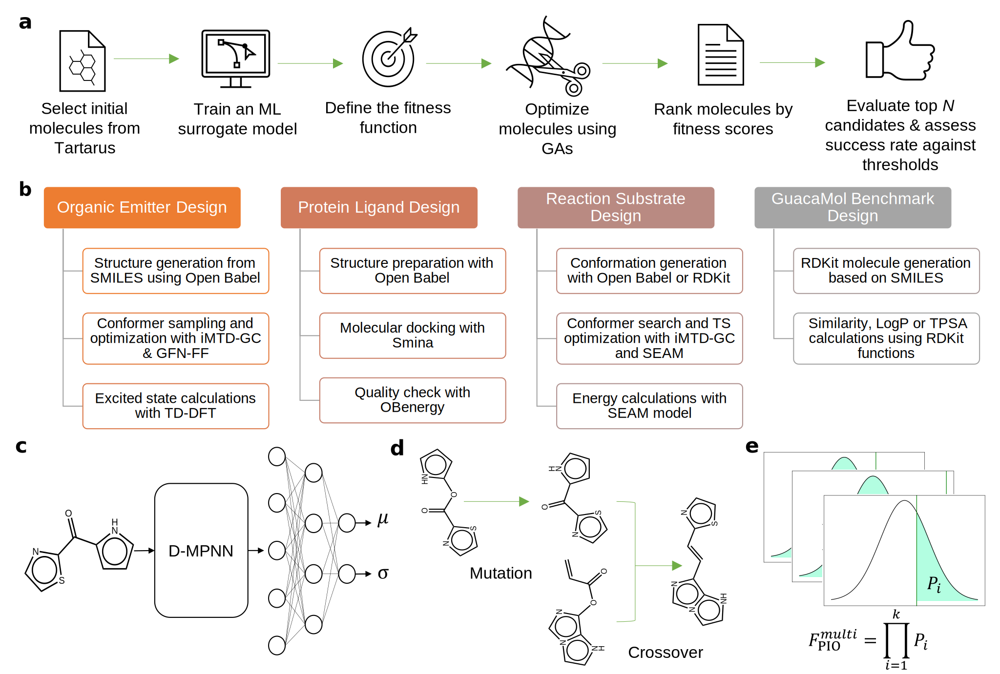

# Uncertainty-Aware Machine Learning Approaches for Robust Molecular Design
This is a uncertainty-aware molecular design framework benchmarked on the Tartarus platform (https://github.com/aspuru-guzik-group/Tartarus).

The manuscript of this repository is in preparation.

<!--  -->


## OS Requirements
This repository requires to operate on **Linux** operating system.

## Python Dependencies
* Python (version >= 3.8)
* rdkit (version >= 2022.3.4)
* torch (versioin >= 1.12.1)
* matplotlib (version >=3.3.4)
* numpy (version >= 1.16.4)
* chemprop  (version >= 1.5.2)
* pandas (version >= 2.0.3)

## Installation
```
bash docs/make_env.sh
```
## Datasets
The datasets used for training Chemporp can be found in Tartarus:

https://github.com/aspuru-guzik-group/Tartarus/tree/main/datasets.

The random splitted datasets for model evaluation can be found in:
1. Docking (protein ligands): [`train_full.csv`](https://github.com/Lung-Yi/uncmoo/blob/main/chemprop_unc/save_models/docking_evidential/fold_0/train_full.csv), [`val_full.csv`](https://github.com/Lung-Yi/uncmoo/blob/main/chemprop_unc/save_models/docking_evidential/fold_0/val_full.csv) and [`test_full.csv`](https://github.com/Lung-Yi/uncmoo/blob/main/chemprop_unc/save_models/docking_evidential/fold_0/test_full.csv).
2. Organic emitter: [`train_full.csv`](https://github.com/Lung-Yi/uncmoo/blob/main/chemprop_unc/save_models/organic_emitter_ensemble_mve/fold_0/train_full.csv), [`val_full.csv`](https://github.com/Lung-Yi/uncmoo/blob/main/chemprop_unc/save_models/organic_emitter_ensemble_mve/fold_0/val_full.csv) and [`test_full.csv`](https://github.com/Lung-Yi/uncmoo/blob/main/chemprop_unc/save_models/organic_emitter_ensemble_mve/fold_0/test_full.csv).
3. Reactivity (reaction substrates): [`train_full.csv`](https://github.com/Lung-Yi/uncmoo/blob/main/chemprop_unc/save_models/reactivity_evidential/fold_0/train_full.csv), [`val_full.csv`](https://github.com/Lung-Yi/uncmoo/blob/main/chemprop_unc/save_models/reactivity_evidential/fold_0/val_full.csv) and [`test_full.csv`](https://github.com/Lung-Yi/uncmoo/blob/main/chemprop_unc/save_models/reactivity_evidential/fold_0/test_full.csv).

## Training surrogate Chemprop models for molecular property predictions.
1. Docking dataset: 1syh, 4lde and 6y2f scores predictions.
```
chemprop_train \
    --data_path Tartarus/datasets/docking.csv \
    --split_sizes 0.8 0.1 0.1 --seed 0 --save_smiles_splits \
    --dataset_type regression \
    --target_columns "1syh score" "4lde score" "6y2f score" \
    --save_dir chemprop_unc/save_models/docking_evidential \
    --warmup_epochs 2 --epochs 40 --max_lr 2e-3 --init_lr 1e-4 \
    --batch_size 128 --final_lr 1e-5 \
    --dropout 0 --hidden_size 600 --ffn_num_layers 2 \
    --save_preds --aggregation sum --activation PReLU --gpu 0 \
    --loss_function evidential --evidential_regularization 0.2
```

2. Organic emitter dataset: singlet-triplet gap, oscillator strength and absoulte difference of vertical excitation energy predictions.
```
chemprop_train \
    --data_path Tartarus/datasets/gdb13.csv \
    --split_sizes 0.8 0.1 0.1 --seed 0 --save_smiles_splits \
    --dataset_type regression \
    --target_columns "singlet-triplet value" "oscillator strength" "abs_diff_vee" \
    --save_dir chemprop_unc/save_models/organic_emitter_ensemble_mve \
    --warmup_epochs 2 --epochs 40 --max_lr 2e-3 --init_lr 1e-4 \
    --batch_size 128 --final_lr 1e-5 \
    --dropout 0 --hidden_size 600 --ffn_num_layers 2 \
    --save_preds --aggregation sum --activation PReLU --gpu 0 \
    --loss_function mve --ensemble_size 10
```

3. Reaction substrate dataset: activation energy and reaction energy predictions.
```
chemprop_train \
    --smiles_columns smiles \
    --data_path Tartarus/datasets/reactivity.csv \
    --split_sizes 0.8 0.1 0.1 --seed 0 --save_smiles_splits \
    --dataset_type regression \
    --target_columns "activation_energy" "reaction_energy" \
    --save_dir chemprop_unc/save_models/reactivity_evidential \
    --warmup_epochs 2 --epochs 40 --max_lr 3e-3 --init_lr 1e-4 \
    --batch_size 64 --final_lr 1e-5 \
    --dropout 0.4 --hidden_size 600 --ffn_num_layers 2 \
    --save_preds --aggregation sum --activation LeakyReLU --gpu 0 \
    --loss_function evidential --evidential_regularization 0.001
```
## Analysis of parity plots and uncertainty calibration
1. Figure 2 (testing data parity plots) in manuscript refers to: [`plot_parity.ipynb`](https://github.com/Lung-Yi/uncmoo/blob/main/plot_parity.ipynb) file.
2. Figure 3 (testing data uncertainty calibration) in manuscript refers to: [`auce_plot.ipynb`](https://github.com/Lung-Yi/uncmoo/blob/main/auce_plot.ipynb) file.

## Design benchmarks cutoff values for single- and multi-objective tasks
| Design Benchmark | Objective | Optimal Value | Top-15% Cutoff for Multi-objective Task |
|------------------|-----------|---------------|----------------------------------------|
| **Organic Emitters** | | | |
| | Singlet-triplet gap (↓) | 0.00249 (eV) | 0.571 |
| | Oscillator strength (↑) | 2.97 (-) | 0.171 |
| | Absolute difference of vertical excitation energy (↓) | 0.0573 (eV) | 1.62 |
| **Protein Ligands** | | | |
| | 1SYH score (↓) | -10.0 (-) | - |
| | 4LDE score (↓) | -10.0 (-) | - |
| | 6Y2F score (↓) | -9.8 (-) | - |
| **Reaction Substrates** | | | |
| | Activation energy (↓) | 72.4 (kcal/mol) | 87.0 (maximization for multi-objective) |
| | Reaction energy (↓) | -17.0 (kcal/mol) | -5.46 |

## Download the molecule generation results using different optimization methods for analysis (optional)
```
gdown --id '1tahu9C0EwlvCNOIXjvz96N2e34TGawyV' --output RESULTS.tar.gz
tar zxvf RESULTS.tar.gz
```

## Single-objective molecular optimization example (probability improvement)
```
DATASET=docking
OBJECTIVE="4lde"
TARGET_NAME="4lde score"
CUTOFF=-10.001
DATA_PATH="docking_normalized.csv"
METHOD=uncertainty
N_SAMPLE=10000
FOLD=1

python janus_benchmark.py --benchmark_data $DATASET \
                          --fitness_method $METHOD --n_sample $N_SAMPLE \
                          --result_path RESULTS/${DATASET}_${OBJECTIVE}/janus_${METHOD}_${FOLD} \
                          --start_smiles_path Tartarus/datasets/$DATA_PATH \
                          --surrogate_model_path chemprop_unc/save_models/docking_evidential/fold_0/ \
                          --target_columns $TARGET_NAME \
                          --target_cutoff CUTOFF \
                          --batch_pred \
                          --target_objective minimize | tee log_${METHOD}_${DATASET}_${OBJECTIVE}_${FOLD}.txt
```
The single-objective molecule design results can then be found in the:
`RESULTS/docking_4lde_score/janus_uncertainty_1/population_explore.txt`
and
`RESULTS/docking_4lde_score/janus_uncertainty_1/fitness_explore.txt`

Further analysis of all the single-objective optimization results refers to:
[`scripts_analyze/analyze_single_objective.ipynb`](https://github.com/Lung-Yi/uncmoo/blob/main/scripts_analyze/analyze_single_objective.ipynb) file.


## Multi-objective molecular optimization example (probability improvement)
```
PARENT="chemprop_unc/save_models"
DATASET=organic_emitter
DATA_PATH="gdb13_normalized.csv"
ALPHATBET="gdb13_alphabet.txt"
SUFFIX="fold_0"
METHOD=uncertainty
N_SAMPLE=10000

FOLD=1
python janus_benchmark.py --benchmark_data $DATASET \
                          --fitness_method $METHOD --n_sample $N_SAMPLE \
                          --result_path RESULTS/$DATASET/janus_${METHOD}_${FOLD} \
                          --start_smiles_path Tartarus/datasets/$DATA_PATH \
                          --surrogate_model_path $PARENT/organic_emitter_ensemble_mve/$SUFFIX \
                          --target_columns "singlet-triplet value" "oscillator strength" "abs_diff_vee" \
                          --target_cutoff 0.57068 0.1706886 1.615238 \
                          --batch_pred \
                          --alphabet_path Tartarus/datasets/$ALPHATBET \
                          --target_objective minimize maximize minimize | tee log_${METHOD}_${DATASET}_${FOLD}.txt
```
The multi-objective molecule design results can then be found in the:
`RESULTS/organic_emitter/janus_uncertainty_1/population_explore.txt`
and
`RESULTS/organic_emitter/janus_uncertainty_1/fitness_explore.txt`

Further analysis of all the multi-objective optimization results refers to:
[`scripts_analyze/plot_multi_objective.ipynb`](https://github.com/Lung-Yi/uncmoo/blob/main/scripts_analyze/plot_multi_objective.ipynb) file.

## Objective function selection for calculating the different fitness
### Single-objective
| Argument for `--fitness_method` | Method                         |
|---------------------------------|--------------------------------|
| `uncertainty`                   | Probabilistic Improvement Optimization (PIO) |
| `scaler`                        | Direct Objective Maximization (DOM)          |
| `expected_improvement`          | Expected Improvement (EI)                    |

### Multi-objective
| Argument for `--fitness_method` | Method               |
|--------------|--------------------------------|
| `uncertainty`| Probabilistic Improvement Optimization (PIO)  |
| `scaler`     | Weighted Sum (WS)                             |
| `utopian`    | Normalized Manhattan Distance (NMD)           |
| `hybrid`     | Hybrid Approach (NMD-WS)                      |
